# 👨‍💻 Tarek Aaraichi

### MSc Energy Engineer | IoT & Embedded Systems Developer | Full Stack

**Bridging the gap between Physical Energy Systems and Cloud Software**

---

### 🚀 Summary

I am a **Hybrid Systems Engineer** specializing in the intersection of energy infrastructure and cloud computing. My work focuses on building **Digital Twins** and **IoT Ecosystems** that provide real-time visibility into physical assets.

- 🔭 **Focus:** Serverless IoT Architectures & Real-time Telemetry
- 🌱 **Learning:** Advanced AWS (CDK/IaC) & Low-level Embedded C++
- 🌍 **Languages:** English, Swedish, Spanish, French, Arabic

---

### 🛠️ Professional Toolbox

| Category        | Tools & Technologies                                                                                                                                                                                                                                                                                                                                                 |
| :-------------- | :------------------------------------------------------------------------------------------------------------------------------------------------------------------------------------------------------------------------------------------------------------------------------------------------------------------------------------------------------------------- |
| **Cloud & IoT** |          |
| **Languages**   |     |
| **Frameworks**  |                                                                                     |
| **DevOps**      |                                                                             |

---

### 🏆 Featured Spotlight

> **[AWS Serverless Fleet Management](https://github.com/TarekAaraichi/AWS-Serverless-IoT-Fleet-Management-System)** > _A Cloud-Native Digital Twin Prototype_
>
> 🚀 **Mission:** Build a serverless architecture to simulate and visualize real-time telemetry from a vehicle fleet in Stockholm.
>
> `AWS IoT Core` `DynamoDB` `Lambda` `React` `Python Simulator`
>
> **[Explore Repository](https://github.com/TarekAaraichi/AWS-Serverless-IoT-Fleet-Management-System)**

---

### 📊 Analytical Overview

  

  
  

 

  

---

### 📬 Connect & Collaborate

I am always open to discussing **IoT architectures**, **Energy Optimization**, or **Cloud Infrastructure**. Feel free to reach out for collaboration or just a technical chat!

  
  

